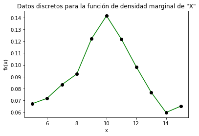
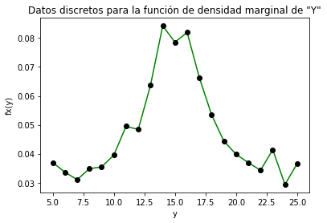
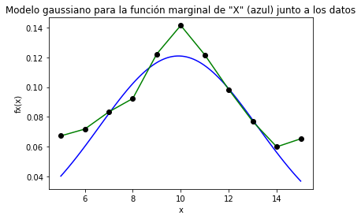
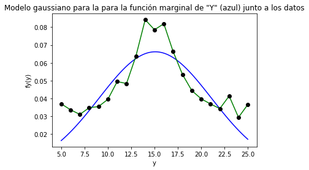
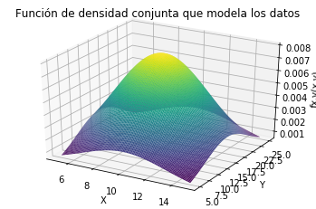

# Tarea 3 - MPSS - Elena Villalobos Herra - B78335
___
## 1. A partir de los datos, encontrar la mejor curva de ajuste (modelo probabilístico) para las funciones de densidad marginales de X y Y.

Tras procesar la información en python, se obtuvieron los datos (discretos) de las funciones de densidad marginales de X y Y, los cuales se graficaron para elegir con cuál curva se modelarían:

 

Se determinó que ambas curvas se modelarían con una distribución gaussiana, debido a que los datos se asemejan a una campana de Gauss. La función requiere de dos parámetros; sigma (desviación estándar)y mu (media), como se observa a continuación:

    

 

Una vez que dicha función se ingresó en Python, con ayuda de *curve_fit*, se encontraron los parámetros que acercan lo más posible, la función de la forma gaussiana a los datos disponibles.

En el caso de la función de densidad marginal de X, los parámetros encontrados fueron sigma = 3.29944 y mu = 9.90484; resultando en la siguiente función:

    

 

Por otra parte, para Y los parámetros fueron sigma = 6.0269 y mu = 15.0795. A continuación se muestra el resultado de modelar la función de densidad marginal de Y:

    

 

En el punto 4 de la tarea, se mostrarán las gráficas de estas funciones para compararlas con los datos discretos que se tenían.

## 2. Asumir independencia de X y Y, ¿cuál es entonces la función de densidad conjunta que modela los datos?

Si se da por sentado la independencia de las variables aleatorias X y Y, la función de densidad conjunta que modela los datos  es la multiplicación de las funciones de densidad marginales de cada variable; es decir:

    

Ya se tienen las expresiones para las funciones de densidad marginales de X y Y, por lo tanto la función de densidad conjunta que modela los datos es la siguiente:

    

  

## 3. Hallar los valores de correlación, covarianza y coeficiente de correlación (Pearson) para los datos y explicar su significado.

- **Correlación:**

    

  

Este momento se puede interpretar como cuán linealmente asociadas se encuentran dos variables aleatorias. Es importante mencionar que si hay independencia estadística, se puede afirmar que dos variables no están correlacionadas. Ya se asumió en el punto 2 de la tarea que las variables con las que se trabaja son independientes, por lo que se espera que la correlación sea igual a la multiplicación de la media de las variables aleatorias (estos valores son el parámetro mu, que ya fue obtenido):

    

  

Como se observa, 149.5428 es sumamente similar a 149.3597; por lo que es posible afirmar que las variables X y Y no están correlacionadas. 

Otro punto importante sobre la correlación que se explicó en clase, es que esta no implica causalidad. Es decir, incluso si las variables hubiesen estado correlacionadas, esto únicamente implicaría que su comportamiento es similar; no que una variable se vea directamente afectada por algún cambio en la otra variable.

- **Covarianza:**

La covarianza puede indicar si para dos variables aleatorias, existe una variación conjunta respecto a sus medias
En la materia del curso, se especifica que si dos variables aleatorias son independientes o no están correlacionadas (que en este caso suceden ambas cosas), se esperará que la covarianza sea cero. 
Tras calcularla con ayuda de Python, se obtuvo lo siguiente:

    

 

Este valor no es exactamente cero, pero sí es muy pequeño, como se esperaba.

- **Coeficiente de correlación**

El coeficiente de correlación, se encuentra entre -1 y 1. Es una medida de dependencia lineal entre dos variables aleatorias. Si se tiene un valor de este coeficiente positivo, se entiende que existe una correlación positiva; se puede interpretar como que ambas variables aumentan o disminuyen a la vez. Si el valor es negativo, implica que cuando una de las variables aumenta, la otra estará disminuyendo (recordando que no necesariamente sucede una cosa en una variable debido a la otra, simplemente se expresa que existe un cierto sincronismo en el comportamiento de las variables). 

Tras calcular este valor, se obtiene lo siguiente:

    
  

 

Si el valor del coeficiente de correlación es cero, indicaría que no existe una dependencia lineal entre las varibles; y como el valor obtenido es muy cercano a cero, se puede interpretar como esta situación.

## 4. Graficar las funciones de densidad marginales (2D), la función de densidad conjunta (3D):

Se muestran las gráficas solicitadas:

